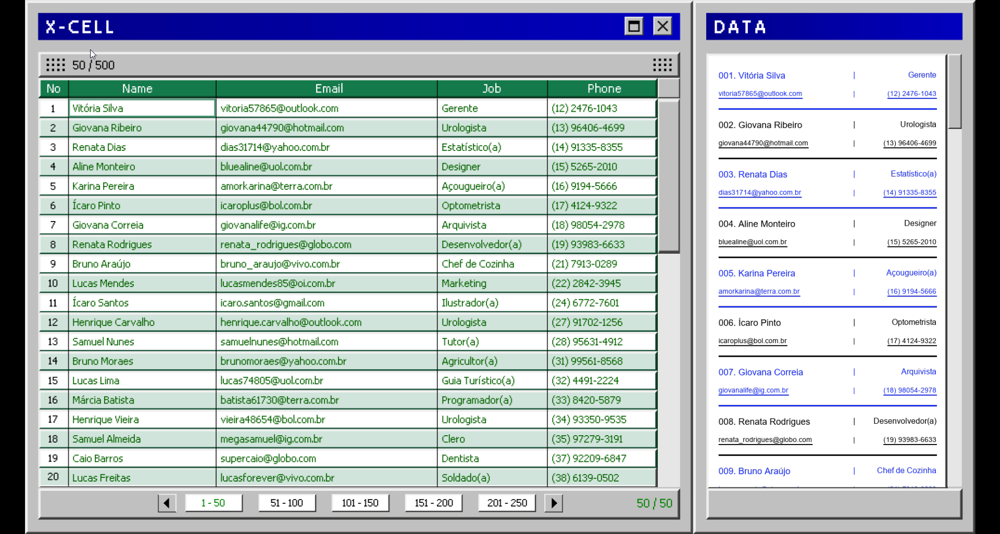
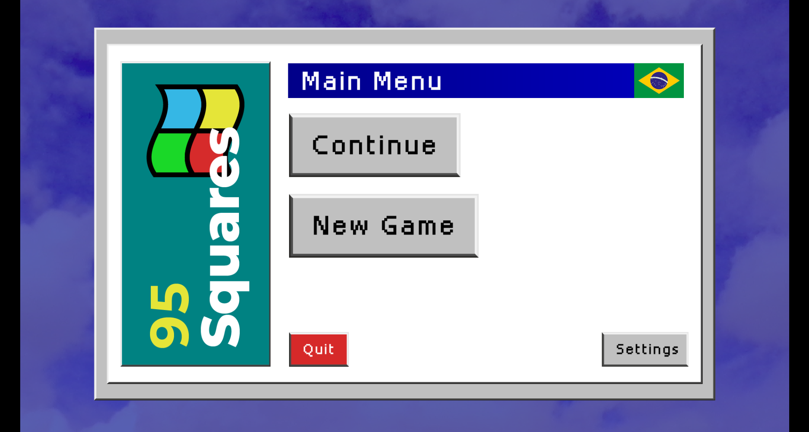

# Spreadsheets and Nothing More — Patch de dados em português (Steam)

> 🤖 **DISCLAIMER / AVISO**
>
> **PT-BR:**
> 🚨 **ATENÇÃO**: Todos os dados, traduções e materiais neste repositório foram gerados com o auxílio de Inteligência Artificial (IA). Podem existir imprecisões ou erros decorrentes do processo de geração automática. Qualquer semelhança com dados, pessoas ou situações reais é mera coincidência.
>
> **EN-US:**
> 🚨 **WARNING**: All data, translations, and materials in this repository were generated using Artificial Intelligence (AI). There may be inaccuracies or errors resulting from the automatic generation process. Any resemblance to real data, persons, or situations is purely coincidental.

Este guia explica como aplicar o patch de dados em português no jogo “Spreadsheets and Nothing More” usando apenas a interface da Steam (e também como alternativa manual, se preferir).

## O que o script faz
- Usa o utilitário GDRETools para embutir arquivos traduzidos na instalação do jogo.
- Baixa automaticamente a versão mais recente do GDRETools (se não estiver na pasta do script).
- Substitui o executável do jogo por uma versão “patchada” com os dados localizados.

## Estrutura necessária
Coloque estes itens juntos:
- patch_with_gdretools.bat (este repositório)
- pasta overwrites/ (já incluída no repositório, não altere a estrutura interna)

O script tentará encontrar o arquivo do jogo: `Spreadsheets.exe`.

## Pré‑requisitos
- Windows com acesso à internet (para baixar GDRETools, caso não esteja incluído).
- Cópia do jogo “Spreadsheets and Nothing More” instalada via Steam.
- Feche o jogo antes de aplicar o patch.

## Como baixar o patch pela página do GitHub
- Abra a página deste repositório no GitHub.
- Clique em “Code” (botão verde) > “Download ZIP”.
- Extraia o ZIP em uma pasta de sua preferência.
- Dentro, você terá `patch_with_gdretools.bat` e a pasta `overwrites/`.
- Em seguida, siga o procedimento abaixo para aplicar o patch.

## Procedimentos para aplicar o patch
1) Steam > Biblioteca > clique com o botão direito no “Spreadsheets and Nothing More”.
2) Gerenciar > Procurar ficheiros locais (Browse local files). Isso abrirá a pasta do jogo no Windows.
3) Copie `patch_with_gdretools.bat` e a pasta `overwrites/` para a pasta principal do jogo (a mesma onde está `Spreadsheets.exe`).
4) Dê duplo clique em `patch_with_gdretools.bat`.
5) Aguarde até ver a mensagem de sucesso (veja a seção “Verificando o sucesso”).

Observação: este é o método mais simples porque o script encontra automaticamente `Spreadsheets.exe` quando está na mesma pasta.

## Verificando o sucesso
- Ao final, o script exibe: `Cleanup concluido. Saindo com codigo 0.`
- O arquivo `Spreadsheets.exe` é substituído pela versão patchada (o script cria um arquivo temporário `Spreadsheets_patched.exe` e então faz a troca).
- Se quiser validar, inicie o jogo e confira se no canto do menu principal aparece uma bandeira do Brasil.
  

## Remoção/reversão
- Verifique a integridade dos ficheiros do jogo pela Steam (Propriedades > Ficheiros instalados > Verificar integridade).
